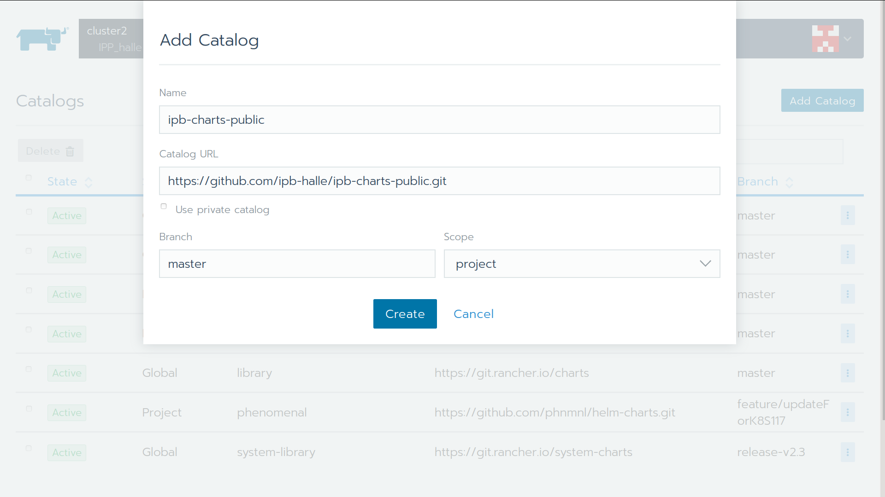

# ipb-charts-public
Packaging of applications for Kubernetes as Helm charts or Rancher Apps

## Configurable values

Only a few properties *have* to be configured for each site and installation:

## MetFrag

You can install the MetFrag web applications

During the very first installation, the postgres file is filled
with (among others) the PostGres database. This can take around six hours,
depending on the speed and I/O in your kubernetes cluster. Since that data
will be persisted, subsequent starts are much faster. Note: if you allow
rancher/helm to create a random app name (and not a fixed, say "metfrag"),
EACH initialisation will create its own database, taking hours to fill.

### Hostname for the ingress

The apps such as MetFrag will be available at a particular URL,
and the hostname has to be declared as `webfqdn` (using the fully qualified domain name FQDN).

Similarly, the apps MAY be served at a particular path,
especially if you are using a reverse proxy to multiplex/route
the incoming traffic to different services. The path has to be
declared as `webpath` (currently without trailing slash, not sure if that
  is a requirement).

The full URL then becomes http(s)://webfqdn/webpath
For a root configuration use "/".

### Configuring Lets Encrypt tls

To enable Lets Encrypt https certificates, you need to provide
1) a valid eMail (not some @example.com address) and a real DNS name,
i.e. `metfrag.u.v.w.x.nip.io` usually won't work. Also, you need
a working cert-manager in your K8S cluster.

## Usage with Helm

help pleeze !

## Usage with Rancher

Rancher (https://rancher.com/) is a Kubernetes distribution and management system.
Their concept of "Apps" is built upon the ideas in Helm, and in general Helm charts should be compatible and deployable as Rancher "Apps".

### Command Line Interface (CLI)

The rancher CLI (https://rancher.com/docs/rancher/v2.x/en/cli/)
allows to add this repository as App catalog and to install MetFrag:

```
rancher catalog add --branch master ipb-charts-public https://github.com/ipb-halle/ipb-charts-public.git
```

Once the catalog is imported, you can install MetFrag with
```
rancher app install metfrag

## Or even provide a few settings:
rancher apps install -n metfragdenbi --set FeedbackEmailTo=sneumann@ipb-halle.de --set persistence.storageClass=longhorn --set webpath=/MF --set ingress.enabled=true --set ingress.tls[0].secretName=metfrag-cert --set ingress.tls[0].hosts[0]=metfrag-cert metfrag metfrag

## Or for IPB:
rancher apps install -n metfragbeta --set FeedbackEmailTo=sneumann@ipb-halle.de --set persistence.storageClass=nfs-client --set webpath=/MetFragBeta --set ingress.enabled=true --set ingress.hosts[0].host=msbi.ipb-halle.de metfrag metfrag
# and parallel a deNBI variant @ IPB:
rancher apps install -n metfraghelm --set FeedbackEmailTo=sneumann@ipb-halle.de --set persistence.storageClass=nfs-client-unity --set webpath=/MetFrag-deNBI --set ingress.enabled=true --set ingress.hosts[0].host=msbi.ipb-halle.de metfrag metfrag-denbi
```

### Rancher Web GUI

In the GUI you follow similar steps, adding the Catalog first:



Then you can search for MetFrag


and install

